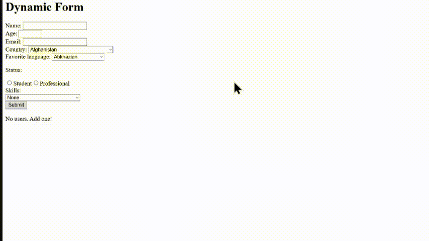

# Dynamic Form
Build a registration/profile form.
## Fields:
- Name
- Age
- Email
- Country
- Favorite language
- Student/professional
- Skills
Add validation.

The interesting part:
my form should be represented by an object.

```tsx
type UserForm = {
    name: string;
    age: number;
    email: string;
    country: string;
};
```

## Learn
React:
- controlled inputs
- event handling
- conditional rendering
TypeScript:
- interfaces
- optional properties
- union types

For example:
```tsx
type Status = "student" | "professional";
```

Goal: Stop treating TypeScript as "JavaScript with annotations."

# Versions
## Version 1
```tsx
/*
    - Name
    - Age
    - Email
    - Country
    - Favorite language
    - Student/professional
    - Skills
*/

import { useEffect, useState } from "react";
import { countries } from "../data/countries";
import { languages } from "../data/languages";
import { skills } from "../data/skills";

export default function Form()
{
    type StatusType = "Student" | "Professional";

    type UserForm = {
        name: string,
        age: number,
        email: string,
        country: string,
        favoriteLanguage: string,
        status: StatusType,
        skills: string[]
    }

    let [skillsSet, setSkillsSet] = useState<string[]>([""]);
    let [users, setUsers] = useState<UserForm[]>([]);

    let countriesList = countries;
    let languagesList = languages;
    let skillsList = skills;

    function submitForm(e: any) {
        e.preventDefault();

        const form = e.currentTarget;

        let nameInput = form["name-input"];
        let ageInput = form["age-input"];
        let emailInput = form["email-input"];
        let countryInput = form["country-input"];
        let languageInput = form["language-input"];
        let statusInput = form["status-input"];

        const userResult: UserForm = {
            name: nameInput.value,
            age: Number(ageInput.value),
            email: emailInput.value,
            country: countryInput.value,
            favoriteLanguage: languageInput.value,
            status: statusInput.value as StatusType,
            skills: skillsSet
        };

        setUsers(prevUsers => [...prevUsers, userResult]);

        setSkillsSet([""])

        // console.log(userResult)
        
    }

    useEffect(() => {
        console.log(users);
    }, [users])


    return(
        <>
            <h1>Dynamic Form</h1>
            <form id="form" onSubmit={submitForm}>
                <label htmlFor="name">Name: </label> <input id="name-input" type="text" required/>
                <br />

                <label htmlFor="age">Age: </label> <input id="age-input" type="number" value={18} min={18} max={65} required/>
                <br />
                
                <label htmlFor="name">Email: </label> <input id="email-input" type="text" required/>
                <br />

                <label htmlFor="country">Country: </label>
                <select name="country" id="country-input" required>
                    <option value="" disabled>
                        Select a country
                    </option>

                    {countriesList.map((country) => 
                        <option key={country.code} value={country.code + "-" + country.name}>{country.name}</option>
                    )}
                </select>
                <br />

                <label htmlFor="langauge" >Favorite language: </label>
                <select name="langauge" id="language-input" required>
                    <option value="" disabled>
                        Select a language
                    </option>

                    {languagesList.map((language) => 
                        <option key={language.code} value={language.code + "-" + language.name}>{language.name}</option>
                    )}
                </select>
                <br />

                <p>Status:</p>
                <input type="radio" name="status" value={"Student"} id="status-input" required/>
                <label htmlFor="status">Student</label>
                <input type="radio" name="status" value={"Professional"} id="status-input" required />
                <label htmlFor="status">Professional</label>

                <br />
                
                <label htmlFor="skills">Skills: </label> <br />
                {skillsSet.map((selectedSkill, index) => 
                    <div >
                        <select key={index} name="skills" id="skills-input"
                                value={selectedSkill}
                                onChange={(e) => {
                                    const newSkills = [...skillsSet];
                                    newSkills[index] = e.target.value;
                                    setSkillsSet([...newSkills])
                                }}
                                required={index > 0}
                                >
                            <option value="" disabled>
                                None
                            </option>

                            {skillsList.map((skill) => 
                                <option key={skill.code} value={skill.name}>{skill.name}</option>
                            )}

                        </select>
                        {index === skillsSet.length - 1 && skillsSet[skillsSet.length - 1] != "" ?
                            <button type="button" onClick={() => setSkillsSet([...skillsSet, ""])}>+</button>
                                :
                             null}
                    </div>
                )}

                <button type="submit">Submit</button>

            </form>

            {users.length === 0 ? (
                <p>No users. Add one!</p>
            ) : (
                users.map((user, index) => {
                    return (
                        <div className="user-card" key={index}>
                            <h2>{user.name}</h2>
                            <p>Age: {user.age}</p>
                            <p>Email: {user.email}</p>
                            <p>Country: {user.country.split("-")[1]}</p>
                            <h3>
                                Favorite Language: {user.favoriteLanguage.split("-")[1]}
                            </h3>
                            <p>Status: {user.status}</p>

                            <p>Skill(s):</p>
                            <ul>
                                {user.skills[0] == "" && user.skills.length === 1 ? (
                                    <li>This user has no skills.</li>
                                ) : (
                                    user.skills.map((skill, skillIndex) => (
                                        <li key={skillIndex}>{skill}</li>
                                    ))
                                )}
                            </ul>
                        </div>
                    );
                })
            )}
        </>
    )
}
```
- All inputs are required. Except for the skills input if the user has decided to choose no skill for the first one.
- The value for the age has been limited to between 18 and 40
- All submitted users' result will be shown below.

## What I Learned
- When using event handlers, "e.target" can be used to the element where the event actually happened, where "e.currentTarget" can be used to the element whose event handler is currently running. For example, in a form's "onSubmit" property, if it has a function, "e.currentTarget" can be used to point to the form.
- I can access HTML forms properties with bracket notations.
- I really have to be wise to when to use useState or to just deeclare a normal variable. Most times, if something will depend on the variable, I will use useState.
- I should be cautious whether what I'm writing is inside JavaScript brackets "{}" or not.
- Use "as" if there is already an object property that is specifically designed to use a specific type.
- useState can be really useful when I know it can be paired with an input's onChange property
- I realized that React props can directly take boolean expressions. For example: required={skillsSet.length > 1} will result in either required=true or required=false

# Result
