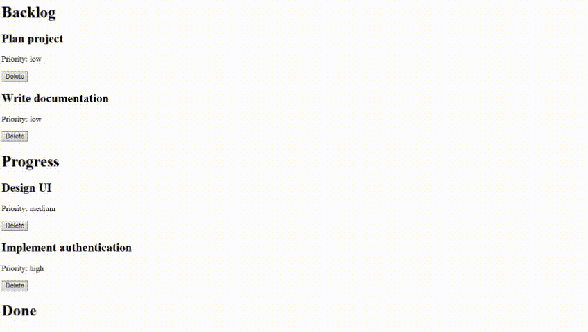

# Task Board

Not a generic Todo app.

Make something more like:

```
BACKLOG       IN PROGRESS       DONE

Research      Build API         Deploy
Design        Write tests       README
```

Each task:

```tsx
type Task = {
    id: string;
    title: string;
    priority: "low" | "medium" | "high";
    status: "backlog" | "progress" | "done";
};
```

## Learn

React:

- components
- props
- lifting state
- list rendering
- keys

TypeScript:

```tsx
type TaskCardProps = {
    task: Task;
    onDelete: (id: string) => void;
};
```

That function typing is **important**.

**Goal:** Become comfortable passing typed data and functions between components.

# Versions
## Version 1
TaskCard.tsx
```tsx
export type TaskType = {
    id: number;
    title: string;
    priority: "low" | "medium" | "high";
    status: "backlog" | "progress" | "done";
};

export type TaskCardType = {
    task: TaskType;
    onDelete: (id: number) => void;
};

export default function TaskCard({ task, onDelete }: TaskCardType) {
    return (
        <div key={task.id}>
            {/* <p>id: {task.id}</p> */}
            <h2>{task.title}</h2>
            <h3>Priority: {task.priority}</h3>
            <p>Status: {task.status}</p>

            <button onClick={() => onDelete(task.id)}>
                Delete
            </button>
        </div>
    );
}
```
TaskBoard.tsx
```tsx
import { useState } from "react";
import TaskCard from "./TaskCard"
import type { TaskType, TaskCardType } from "./TaskCard"

export default function TaskBoard()
{
    const [userTasks, setUserTasks] = useState<TaskType[]>([
        {
            id: 1,
            title: "Plan project",
            priority: "low",
            status: "backlog"
        },
        {
            id: 2,
            title: "Design UI",
            priority: "medium",
            status: "progress"
        },
        {
            id: 3,
            title: "Implement authentication",
            priority: "high",
            status: "progress"
        },
        {
            id: 4,
            title: "Write documentation",
            priority: "low",
            status: "backlog"
        },
        {
            id: 5,
            title: "Deploy application",
            priority: "high",
            status: "done"
        }
    ]);

    function handleDelete(id: number): void {
        setUserTasks(tasks => tasks.filter(task => task.id !== id));
    }
    
    function createTask(task: TaskType)
    {
        return(
            <TaskCard 
                task={task}
                onDelete={handleDelete}
            />
        )
    }

    return(
        <>
            <h1>Backlog</h1>
            {userTasks
                .filter(task => task.status === "backlog")
                .map(createTask)
            }
            
            <h1>Progress</h1>
            {userTasks
                .filter(task => task.status === "progress")
                .map(createTask)
            }
            <h1>Done</h1>
            {userTasks
                .filter(task => task.status === "done")
                .map(createTask)
            }
        </>
    )
}
```
- Uses useState for the tasks array.
- Filtering for DOM render is done based on the tasks' status. Done three times, one time for each.
## Version 2
/components/TaskBoard.tsx
```tsx
import TaskColumn from "./TaskColumn"

export default function TaskBoard()
{
    return(
        <>
            <TaskColumn status="backlog" />
            <TaskColumn status="progress" />
            <TaskColumn status="done" />
        </>
    )
}
```
/components/TaskCard.tsx
```tsx
export type TaskType = {
    id: number;
    title: string;
    priority: "low" | "medium" | "high";
    status: "backlog" | "progress" | "done";
};

export type TaskCardType = {
    task: TaskType;
    onDelete: (id: number) => void;
};

export default function TaskCard({ task, onDelete }: TaskCardType) {
    return (
        <div key={task.id}>
            {/* <p>id: {task.id}</p> */}
            <h2>{task.title}</h2>
            <p>Priority: {task.priority}</p>

            <button onClick={() => onDelete(task.id)}>
                Delete
            </button>
        </div>
    );
}
```
/components/TaskColumn.tsx
```tsx
import TaskCard, { type TaskType } from "./TaskCard";
import { useUserTasks } from "../data/tasks";

export default function TaskColumn({status}: {status: string})
{
    const { userTasks, setUserTasks } = useUserTasks();

    function handleDelete(id: number)
    {
        setUserTasks((tasks) => tasks.filter(task => task.id !== id))
    }

    const selectedTasks = userTasks
        .filter(task => task.status === status)
        .map(task => (
            <TaskCard
                key={task.id}
                task={task}
                onDelete={handleDelete}
            />
        ));

    return(
        <div>
            <h1>{(status.charAt(0).toUpperCase() + status.slice(1))}</h1>
            {selectedTasks.length === 0 ? "No task on this level." : selectedTasks}
        </div>
    )
    
}
```
/data/tasks.ts
```tsx
// hooks/useUserTasks.ts
import { useState } from "react";
import type { TaskType } from "../components/TaskCard";

export const useUserTasks = () => {
  const [userTasks, setUserTasks] = useState<TaskType[]>([
    {
      id: 1,
      title: "Plan project",
      priority: "low",
      status: "backlog",
    },
    {
      id: 2,
      title: "Design UI",
      priority: "medium",
      status: "progress",
    },
    {
      id: 3,
      title: "Implement authentication",
      priority: "high",
      status: "progress",
    },
    {
      id: 4,
      title: "Write documentation",
      priority: "low",
      status: "backlog",
    },
    {
      id: 5,
      title: "Deploy application",
      priority: "high",
      status: "done",
    },
  ]);

  return { userTasks, setUserTasks };
};
```
- Now, tasks are imported and still are using useState
- Added easier mapping with using TaskColumn.tsx


# What I Learned
- .map() determines what gets passed into your callback based on the type/shape of the array you're mapping over.
- I can do arrayVariable.filter().map() to filter specific parts of the array I want to map
- If I wanna import and export a useState and it's setter, wrap it as a function,

# Result
