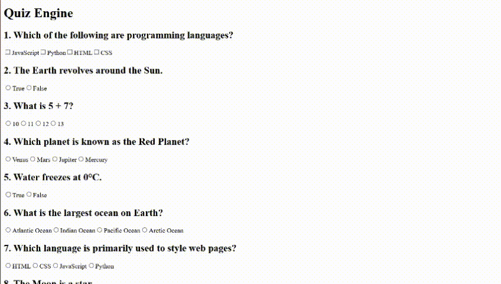

# Quiz Engine

Build a quiz system.

Not just:

> Question → answer → next.

## Fields
Make it support:

- multiple choice
- true/false
- score
- timer
- question navigation
- results

Now TypeScript gets interesting.

```tsx
type Question =
    | {
        type: "multiple-choice";
        question: string;
        options: string[];
        answer: string;
    }
    | {
        type: "true-false";
        question: string;
        answer: boolean;
    };
```

That's a **discriminated union**.

Then:

```tsx
if (question.type === "multiple-choice") {
    // TypeScript knows options exists
}
```

# Versions
## Version 1
src/data/questions.ts
```tsx
export type QuestionType =
    | {
          id: number;
          type: "multiple-choice";
          question: string;
          options: string[];
          answer: string[];
      }
    | {
          id: number;
          type: "true-false";
          question: string;
          answer: boolean;
      }
    | {
          id: number;
          type: "one-answer";
          question: string;
          options: string[];
          answer: string;
      };

export const questions: QuestionType[] = [
    {
        id: 1,
        type: "multiple-choice",
        question: "Which of the following are programming languages?",
        options: ["JavaScript", "Python", "HTML", "CSS"],
        answer: ["JavaScript", "Python"],
    },

    {
        id: 2,
        type: "true-false",
        question: "The Earth revolves around the Sun.",
        answer: true,
    },

    {
        id: 3,
        type: "one-answer",
        question: "What is 5 + 7?",
        options: ["10", "11", "12", "13"],
        answer: "12",
    },

    {
        id: 4,
        type: "one-answer",
        question: "Which planet is known as the Red Planet?",
        options: ["Venus", "Mars", "Jupiter", "Mercury"],
        answer: "Mars",
    },

    {
        id: 5,
        type: "true-false",
        question: "Water freezes at 0°C.",
        answer: true,
    },

    {
        id: 6,
        type: "one-answer",
        question: "What is the largest ocean on Earth?",
        options: [
            "Atlantic Ocean",
            "Indian Ocean",
            "Pacific Ocean",
            "Arctic Ocean",
        ],
        answer: "Pacific Ocean",
    },

    {
        id: 7,
        type: "one-answer",
        question: "Which language is primarily used to style web pages?",
        options: ["HTML", "CSS", "JavaScript", "Python"],
        answer: "CSS",
    },

    {
        id: 8,
        type: "true-false",
        question: "The Moon is a star.",
        answer: false,
    },

    {
        id: 9,
        type: "one-answer",
        question: "What is the chemical symbol for gold?",
        options: ["Ag", "Au", "Fe", "Cu"],
        answer: "Au",
    },

    {
        id: 10,
        type: "one-answer",
        question: "How many continents are there?",
        options: ["5", "6", "7", "8"],
        answer: "7",
    },
    {
        id: 11,
        type: "multiple-choice",
        question: "Which of the following are mammals?",
        options: ["Dolphin", "Eagle", "Elephant", "Shark"],
        answer: ["Dolphin", "Elephant"],
    },

    {
        id: 12,
        type: "true-false",
        question: "JavaScript can be used to make web pages interactive.",
        answer: true,
    },

    {
        id: 13,
        type: "one-answer",
        question: "What is 9 × 6?",
        options: ["42", "48", "54", "56"],
        answer: "54",
    },

    {
        id: 14,
        type: "one-answer",
        question: "What is the capital city of France?",
        options: ["London", "Paris", "Berlin", "Madrid"],
        answer: "Paris",
    },

    {
        id: 15,
        type: "true-false",
        question: "The Sun is a planet.",
        answer: false,
    },

    {
        id: 16,
        type: "multiple-choice",
        question: "Which of the following are frontend web technologies?",
        options: ["HTML", "CSS", "JavaScript", "SQL"],
        answer: ["HTML", "CSS", "JavaScript"],
    },

    {
        id: 17,
        type: "one-answer",
        question: "How many sides does a hexagon have?",
        options: ["5", "6", "7", "8"],
        answer: "6",
    },

    {
        id: 18,
        type: "true-false",
        question: "Python is a programming language.",
        answer: true,
    },

    {
        id: 19,
        type: "one-answer",
        question: "Which gas do humans need to breathe to survive?",
        options: ["Carbon dioxide", "Oxygen", "Hydrogen", "Nitrogen"],
        answer: "Oxygen",
    },

    {
        id: 20,
        type: "multiple-choice",
        question: "Which of the following are primary colors of light?",
        options: ["Red", "Green", "Blue", "Yellow"],
        answer: ["Red", "Green", "Blue"],
    },
];
```
src/components/quiz.tsx
```tsx
import { useEffect, useState } from "react";
import type { QuestionType } from "../data/questions"; 
import { questions } from "../data/questions";

export default function Quiz()
{

    let [userAnswer, setUserAnswer] = useState<Record<number, string | string[] | boolean>>({})
    let [answerStatus, setAnswerStatus] = useState<boolean[]>([]);


    useEffect(() => {
        const statuses = questions.map((question, i) =>
            JSON.stringify(userAnswer[i + 1]) ===
            JSON.stringify(question.answer)
        );

        setAnswerStatus(statuses);
    }, [userAnswer, questions]);

    useEffect(() => {
        revealResult();
    }, [answerStatus]);

    function revealResult()
    {
        if (Object.keys(userAnswer).length === 0) {
            return;
        }

        let questionResults = document.querySelectorAll("[data-question-id]");

        questionResults.forEach(question => 
        {
            const id = question.getAttribute("data-question-id");

            let result = question.querySelector('[data-result-id]');
            if(!result) return;

            // console.log(answerStatus[Number(id) - 1] + " " + result.getAttribute("data-result-id"));

            answerStatus[Number(id) - 1] === true ? result.textContent = "Correct ✅" : result.textContent = "Wrong ❌";

            result.setAttribute('style', 'display: block;');

        })
    }


    function setAnswers(event: any)
    {

        event.preventDefault();

        const questionDivs = document.querySelectorAll("[data-question-id]");

        let ansArrayFinal: Record<number, string | string[]> = {}

        questionDivs.forEach(question => {
            const qId = Number(question?.getAttribute("data-question-id"))

            const answer = question.querySelectorAll<any>(
                "label > input:checked"
            );

            if(answer.length !== 1)
            {
                const ansArray = []
                for(let i = 0; i < answer.length; i++)
                {
                    ansArray[i] = answer[i].getAttribute("value")
                }
                ansArrayFinal[qId] = ansArray;
            }
            else
            {
                let individualAnswer = answer[0].getAttribute("value");
                if (individualAnswer === "true" || individualAnswer === "false") {
                    individualAnswer = (individualAnswer === "true");
                }
                ansArrayFinal[qId] = individualAnswer;
            }
            setUserAnswer(ansArrayFinal);
        })
        
        
    }

    function renderMultipleQuestions(question: QuestionType)
    {
        if(question.type === "multiple-choice")
        {
            return(
                <div data-question-id={question.id} key={question.id}>
                    <h2>{question.id}. {question.question}</h2>
                    <p data-result-id={question.id} style={{display: "none"}}>Correct/Wrong</p>
                    {question.options.map(option => {
                        return (
                            <label>
                                <input type="checkbox" value={option} name={`q${question.id}`}/>
                                {option}
                            </label>
                        )
                    })}
                </div>
                
            )
        }

        return null;

    }

    function renderTrueFalseQuestions(question: QuestionType)
    {
        if(question.type === "true-false")
        {
            return(
                <div data-question-id={question.id} key={question.id}>
                    <h2>{question.id}. {question.question}</h2>
                    <p data-result-id={question.id} style={{display: "none"}}>Correct/Wrong</p>
                    <label>
                        <input
                            name={`q${question.id}`}
                            type="radio"
                            value="true"
                        required />
                        True
                    </label>

                    <label>
                        <input
                            name={`q${question.id}`}
                            type="radio"
                            value="false"
                        required />
                        False
                    </label>
                </div>
                
            )
        }

        return null;

    }

    function renderOneAnserQuestions(question: QuestionType)
    {
        if(question.type === "one-answer")
        {
            return(
                <div data-question-id={question.id} key={question.id}>
                    <h2>{question.id}. {question.question}</h2>
                    <p data-result-id={question.id} style={{display: "none"}}>Correct/Wrong</p>
                    {question.options.map(option => {
                        return <label>
                                    <input
                                        name={`q${question.id}`}
                                        type="radio"
                                        value={option}
                                    required />
                                    {option}
                                </label>
                    })}
                </div>
                
            )
        }

        return null;

    }


    return(
        <>  
            <h3 id="overall-result-id"></h3>
            <form onSubmit={setAnswers}>
                {questions.map(question => {
                    return question.type === "multiple-choice" ? renderMultipleQuestions(question) : (question.type === "one-answer" ? renderOneAnserQuestions(question) : renderTrueFalseQuestions(question));
                })}
                <button type="submit">Submit</button>
            </form>
        </>
    )
}
```

# What I Learned
- Type narrowing is an option (I can do it with an if statement) if necessary while dealing with union types.
- JavaScript has two broad categories:
Primitives (string, number, boolean, null, undefined, bigint, symbol), they are compared by	Value. And
Objects (including Array, Object, Date, Map, Set, functions, etc.), are compared by Reference.
- Object.keys(objectName) is used to return an array containing all the keys of an object.
- Use two useEffects when one state update depends on another state update, because React state updates are asynchronous.
- setAttribute('style', 'styleHere') will display ALL inline styling.

# Result
