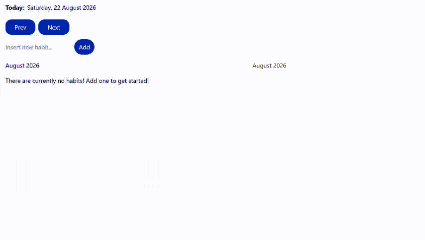

# Habit Tracker v2

Now rebuild the project I just made.

**From scratch.**

And this time:

### Requirements

- Week navigation
- Month navigation
- Today button
- Multiple habits
- Completion tracking
- Progress percentage
- LocalStorage
- Dark/light theme

React:

- `useState`
- `useEffect`
- `useMemo`
- custom hooks

TypeScript:

- date-related types
- domain models
- component props
- localStorage data types

Create:

```tsx
type Habit = {
    id: string;
    name: string;
    completedDates: string[];
};
```

And perhaps:

```tsx
useHabits()
```

as a custom hook.

### The important part

Compare this project with my original.

I should feel:

> "Oh. I understand why I struggled before."

That's progress.

# Versions
## Version 1
src/components/AddHabit.tsx
```tsx
import { useHabitListSetContext } from "../context/HabitEntryListSetContext"
import type { HabitEntryListType } from "./HabitEntryList"

export default function AddHabit()
{

    const {habitEntryListSet, setHabitEntryListSet} = useHabitListSetContext();

    const newHabitEntryList: HabitEntryListType = {
        id: 0,
        habitName: "",
        habitEntryList: []
    }

    function addNewHabitList(event: React.FormEvent<HTMLFormElement>)
    {
        event.preventDefault()

        const form = event.currentTarget;
        const newHabitName = form["new-habit-name"].value

        newHabitEntryList.habitName = newHabitName;

        let newId;

        if(habitEntryListSet.length === 0) newId = 0;
        else newId = (Math.max(...habitEntryListSet.map(entry => entry.id)) + 1);

        newHabitEntryList.id = newId

        setHabitEntryListSet(prev => {
            return [...prev, newHabitEntryList]
        })
    }

    return(
        <div className="flex justify-between max-w-3xl px-4 py-2">
            <form onSubmit={addNewHabitList}>
                <input name="new-habit-name" type="text" placeholder="Insert new habit..." />
                <button type="submit" className={`cursor-pointer px-3 py-2 text-amber-50 rounded-3xl bg-blue-900 hover:bg-blue-700 transition-all`}>Add</button>
            </form>
        </div>
    )
}
```
src/components/HabitEntry.tsx
```tsx
export type HabitEntryType = {
    date?: string,
    isDone?: boolean
    toggleClick?: (dateString: string) => void
}

export default function HabitEntry({date, isDone, day, toggleClick}: HabitEntryType & {day: string})
{

    return <button 
                className={`cursor-pointer px-3 py-2 text-amber-50 rounded-3xl transition-all
                            ${isDone ? `bg-blue-600 hover:bg-blue-900` : `bg-blue-900  hover:bg-blue-600`}
                            `}
                onClick={() => toggleClick?.(date ?? "")}
                >
                    {day} {date?.split("/")[1]}
        </button>
}
```
src/components/HabitEntryList.tsx
```tsx
import { useDateContext } from "../context/DateContext"
import type { HabitEntryType } from "./HabitEntry"
import { days } from "../data/timeNames"
import HabitEntry from "./HabitEntry"
import { useHabitListSetContext } from "../context/HabitEntryListSetContext"

export type HabitEntryListType = {
    id: number,
    habitName: string,
    habitEntryList: HabitEntryType[]
}

export default function HabitEntryList({id, habitName, habitEntryList}: HabitEntryListType)
{
    const {dateTrack} = useDateContext();
    const {setHabitEntryListSet} = useHabitListSetContext();
 
    function getWeekStartDateString(index: number)
    {
        const startWeekDate = new Date(dateTrack);
        startWeekDate.setDate(startWeekDate.getDate() - startWeekDate.getDay() + index);
        return startWeekDate.toLocaleDateString();

    }

    //FIX HERE
    
    function toggleClick(dateString: string) {
        setHabitEntryListSet(prev =>
            prev.map(entry => {
                // If the entry's Id doesn't match, return it (not changing a thing)
                if (entry.id !== id) return entry;

                // I wanna check if the date we're clicking already exists
                // inside this habit's habitEntryList.
                const existingHabitEntry = entry.habitEntryList.find(
                    habitEntry => habitEntry.date === dateString
                );

                // If the date doesn't exist yet, create a new habitEntry for it.
                if (!existingHabitEntry) {
                    return {
                        // provide the other entries
                        ...entry,

                        // Take all the existing habit entries,
                        // then add the newly clicked date to the end.
                        habitEntryList: [
                            ...entry.habitEntryList,
                            {
                                // The date we just clicked
                                date: dateString,

                                // Since we're initializing it by clicking it,
                                // make it done immediately.
                                isDone: true
                            }
                        ]
                    };
                }

                // The date already exists, so now we wanna find it
                // and toggle its isDone value.
                return {
                    // provide the other entries
                    ...entry,

                    // I wanna find something from the habitEntryList array
                    // (the one with date and isDone)
                    habitEntryList: entry.habitEntryList.map(habitEntry => {

                        // If the entry's date doesn't match,
                        // return it (not changing a thing)
                        if (habitEntry.date !== dateString) {
                            return habitEntry;
                        }

                        // If match, do the following thing:
                        return {
                            // provide the other entries
                            ...habitEntry,

                            // This is it. Change the date's isDone to its opposite.
                            isDone: !habitEntry.isDone
                        };
                    })
                };
            })
        );
    }

    function deleteList()
    {
        setHabitEntryListSet(prev => {
            const newList = prev.filter(entry => entry.id !== id)
            return newList
        })
    }

    return(
        <div className="flex flex-col gap-4">
            {/* {habitEntryList.map(habitEntry => {
                return <HabitEntry date={habitEntry.date.split("/")[1]} isDone={habitEntry.isDone} />
            })} */}
            <div className="flex justify-between">
                <h1 className="font-bold text-2xl">{habitName}</h1>
                <button className="outline-orange-700 outline-2 rounded-2xl px-3 py-2 text-orange-700
                                    hover:bg-orange-700 hover:text-amber-50 transition-all cursor-pointer"
                        onClick={deleteList}
                >
                                        Delete
                </button>
            </div>
            
            <div className="flex gap-4">
                {days.map((day, i) => {

                    const specificHabitEntryListDate = getWeekStartDateString(i);
                    const specificHabitEntryListSelection = habitEntryList.find(entry => {
                        return entry.date === specificHabitEntryListDate;
                    })

                    if(habitEntryList?.length === 0)
                    {
                        return <HabitEntry
                                    key={i}
                                    date={getWeekStartDateString(i)}
                                    isDone={false}
                                    day={day}
                                    toggleClick={() => toggleClick(getWeekStartDateString(i))}
                                />     
                    }
                    else
                    {
                        return <HabitEntry
                                    key={i}
                                    date={getWeekStartDateString(i)}
                                    isDone={specificHabitEntryListSelection?.isDone ? specificHabitEntryListSelection?.isDone : false}
                                    day={day} 
                                    toggleClick={() => toggleClick(getWeekStartDateString(i))}
                                    />  
                    } 
                })}
            </div>
        </div>
    )
}
```
src/components/HabitEntryListSet.tsx
```tsx
import { useDateContext } from "../context/DateContext";
import { useHabitListSetContext } from "../context/HabitEntryListSetContext";
import HabitEntryList from "./HabitEntryList";
import { months } from "../data/timeNames";

export default function HabitEntryListSet()
{
    const {habitEntryListSet} = useHabitListSetContext();
    const {dateTrack} = useDateContext();

    function getStartOfWeek()
    {
        const startWeekDate = new Date(dateTrack);
        startWeekDate.setDate(startWeekDate.getDate() - startWeekDate.getDay());
        return startWeekDate;
    }

    function getEndOfWeek()
    {
        const endWeekDate = new Date(dateTrack);
        endWeekDate.setDate(endWeekDate.getDate() + (7 - endWeekDate.getDay()));
        return endWeekDate;
    }

    return(
        <div className="flex-col max-w-3xl">
            <div className="flex justify-between px-4 py-2">
                <h3>{months[getStartOfWeek().getMonth()]} {getStartOfWeek().getFullYear()}</h3>
                <h3>{months[getEndOfWeek().getMonth()]} {getEndOfWeek().getFullYear()}</h3>
            </div>
            <div className="px-4 py-2 flex flex-col gap-4">
                {habitEntryListSet.length === 0 ?
                    <p>There are currently no habits! Add one to get started!</p>
                    :
                    habitEntryListSet.map(habitEntryList => {
                        return(
                            <div key={habitEntryList.id} className="max-w-4xl">
                                <HabitEntryList id={habitEntryList.id}
                                                habitName={habitEntryList.habitName}
                                                habitEntryList={habitEntryList.habitEntryList}
                                />
                            </div>
                        )
                    })
                }
            </div>
        </div>
    )
}
```
src/components/Header.tsx
```tsx
import { useMemo } from "react";
import { useDateContext } from "../context/DateContext"
import { days, months } from "../data/timeNames";

export default function Header()
{
    const {date, dateTrack, setDateTrack} = useDateContext();

    const currentInfo: string[] = useMemo(() => {
        let dayName = days[date.getDay()];
        let dateNumber = String(date.getDate());
        let monthName = months[date.getMonth()];
        let yearNumber = String(date.getFullYear());

        return [dayName, dateNumber, monthName, yearNumber]

    }, [])

    function moveToPreviousWeek()
    {
        const prevWeek = new Date(dateTrack);
        prevWeek.setDate(prevWeek.getDate() - 7)
        setDateTrack(prevWeek)
    }

    function moveToNextWeek()
    {
        const nextWeek = new Date(dateTrack);
        nextWeek.setDate(nextWeek.getDate() + 7)
        setDateTrack(nextWeek)
    }

    return(
        <div>
            <div className="flex gap-2 px-4 py-4">
                <h1 className="font-bold">Today:</h1>
                <p>{currentInfo[0]}, {currentInfo[1]} {currentInfo[2]} {currentInfo[3]}</p>
            </div>
            <div className="flex gap-2 px-4 py-1">
                <button onClick={moveToPreviousWeek} className="bg-blue-800 px-6 py-2 text-amber-50 rounded-2xl hover:bg-blue-900 cursor-pointer">Prev</button>
                <button onClick={moveToNextWeek} className="bg-blue-800 px-6 py-2 text-amber-50 rounded-2xl hover:bg-blue-900 cursor-pointer">Next</button>
            </div>
            {/* <h1>dateTrakt's Current: {dateTrack.getDate()}</h1> */}
        </div>
    )
}
```
src/context/DateContext.tsx
```tsx

```
src/context/HabitEntryListSetContext.tsx
```tsx
import { createContext, useContext, useState, type Dispatch, type ReactNode, type SetStateAction } from "react";

type DateContextType = {
    date: Date,
    setDate: Dispatch<SetStateAction<Date>>,
    dateTrack: Date,
    setDateTrack: Dispatch<SetStateAction<Date>>
}

export const DateContext = createContext<DateContextType | null>(null);

export function useDateContext()
{
    const context = useContext(DateContext);
    if(!context) throw new Error ("DateContext is null! Please use it inside of a provider!");
    return context;
}

export function DateContextProvider({children}: {children: ReactNode})
{
    const [date, setDate] = useState<Date>(new Date());
    const [dateTrack, setDateTrack] = useState<Date>(new Date());

    return(
        <DateContext.Provider value={{date, setDate, dateTrack, setDateTrack}}>
            {children}
        </DateContext.Provider>
    )
}
```
src/App.tsx
```tsx
import { HabitEntryListSetContextProvider } from "./context/HabitEntryListSetContext"
import { DateContextProvider } from "./context/DateContext"
import Header from "./components/Header"
import HabitEntryListSet from "./components/HabitEntryListSet"
import AddHabit from "./components/AddHabit"
import "./App.css"

export default function App()
{
  return(
    <div>
      <DateContextProvider>
      <HabitEntryListSetContextProvider>
        <Header/>
        <AddHabit />
        <HabitEntryListSet />
      </HabitEntryListSetContextProvider>
      </DateContextProvider>
    </div>
    
  )
}

/*
  ================================
  --------------------------------
  Plan:
  --------------------------------
  ================================

  Entire tracker data structure:
  ======================
  1. habitEntry
  ======================
  HabitEntryType:
  {
    date: string (ex: 5/25/2005) (use toLocaleString)
    isDone: boolean (ex: true)
  }


  ======================
  2. habitEntryList
  ======================
  HabitEntryListType:
  {
    id: number,
    habitName: string,
    habitEntryList: HabitEntryType[]
  }

  ======================
  3. habitEntryListSet
  ======================
  HabitEntryListSetType: HabitEntryListType[]

  ================================
  --------------------------------
  Adding habitEntryListSet:
  --------------------------------
  ================================

  From a component that has a field input for the habit's name and an "add" button, if the button is clicked"
  1. Pick the current habitEntryListSet's highest id number (using Math.max)
  2. Extracting the input's name
  3. Initializes the habitEntryList as an empty array.
  Set it.

  ================================
  --------------------------------
  Mapping:
  --------------------------------
  ================================

  1. Make a component that can change weeks to next week or previous week.
  2. Find the current date.
  3. Extract the start of the week date all the way until the end of the week's date.
  For each date, map the:
  NAME
  [MONDAY (date)] [TUESDAY (date)] [...] [...] [...] [...] [...]
  4.  For EVERY untouched/unitialized habitEntry, show the isDone to false. ONLY make a habitEntry when the user clicks it.

  So, no click:
  --------------
  no habitEntry on that date, but shown to be false.

  First click:
  --------------
  { date: (date), isDone: true }

  Second click:
  { date: (date), isDone: false }
*/
```

# What I've Learned
- setDate() is incredibly useful to use if I wanna make sure that changing dates is done properly (knowing some months ends with date of 31, 30, 28, and 29).

# Result


